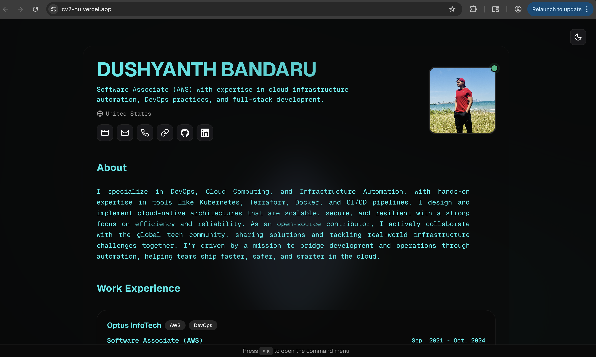

# 🚀 **Dushyanth Bandaru - DevOps & Cloud Engineer Portfolio**

<div align="center">
  
</div>

<br>

<div align="center">

[](https://nextjs.org/)
[](https://www.typescriptlang.org/)
[](https://tailwindcss.com/)
[](https://www.framer.com/motion/)
[](https://vercel.com/)

**Cloud DevOps Engineer & Full-Stack Developer**  
*Building scalable cloud-native solutions with modern technologies*

[🌐 Live Portfolio](https://cv2-1sslwoq9s-dushf12s-projects.vercel.app) • [📧 Email](mailto:dushbanda99@gmail.com) • [💼 LinkedIn](https://www.linkedin.com/in/dushf12) • [🐙 GitHub](https://github.com/dushf12)

</div>

---

## ✨ **Portfolio Features**

### 🎨 **Modern Design & UX**
- **Glassmorphism Effects** - Beautiful glassy animations with fluid gradients
- **Dark/Light Mode Toggle** - Seamless theme switching with smooth transitions
- **Responsive Design** - Optimized for desktop, tablet, and mobile devices
- **Smooth Animations** - Framer Motion powered micro-interactions
- **Print-Friendly Layout** - Perfect for printing as a physical resume

### ⚡ **Performance & Technology**
- **Next.js 15** - Latest React framework with App Router
- **TypeScript** - Type-safe development experience
- **Tailwind CSS** - Utility-first CSS framework
- **Vercel Deployment** - Global CDN with automatic deployments
- **SEO Optimized** - Meta tags and structured data

### 🔧 **Interactive Features**
- **Command Menu** - Quick navigation with keyboard shortcuts (⌘+K)
- **Theme Toggle** - Instant dark/light mode switching
- **Smooth Scrolling** - Enhanced user experience
- **Hover Effects** - Engaging interactive elements

---

## 🛠️ **Tech Stack**

### **Frontend**
- **Framework**: Next.js 15.4.1 (App Router)
- **Language**: TypeScript 5.0
- **Styling**: Tailwind CSS 3.4
- **Animations**: Framer Motion 11.0
- **Icons**: Lucide React

### **Deployment & Hosting**
- **Platform**: Vercel
- **CDN**: Global edge network
- **SSL**: Automatic HTTPS
- **CI/CD**: Automatic deployments

### **Development Tools**
- **Package Manager**: npm
- **Linting**: ESLint
- **Code Formatting**: Prettier
- **Version Control**: Git

---

## 🚀 **Live Demo**

<div align="center">

### **🌐 [View Live Portfolio](https://cv2-1sslwoq9s-dushf12s-projects.vercel.app)**

*Experience the full functionality including responsive design, theme switching, and smooth animations*

</div>

---

## 📁 **Project Structure**

```
cv_dush/
├── src/
│   ├── app/                 # Next.js App Router
│   │   ├── globals.css      # Global styles & animations
│   │   ├── layout.tsx       # Root layout with theme provider
│   │   └── page.tsx         # Main portfolio page
│   ├── components/          # Reusable UI components
│   │   ├── ui/             # Base UI components
│   │   ├── icons/          # Custom SVG icons
│   │   └── theme-toggle.tsx # Dark/light mode toggle
│   ├── data/               # Portfolio content
│   │   └── resume-data.tsx # Personal information & projects
│   └── lib/                # Utility functions
├── public/                 # Static assets
│   └── assets/            # Images & media files
└── README.md              # This file
```

---

## 🎯 **Key Sections**

### **👨‍💻 About Me**
- Professional summary with DevOps expertise
- Cloud computing and infrastructure automation focus
- Open-source contribution highlights

### **💼 Work Experience**
- **Software Associate (AWS)** at Optus InfoTech
- 3+ years of cloud infrastructure automation
- AWS, Terraform, Kubernetes, CI/CD expertise

### **🎓 Education**
- **MS Information Technology** - Florida State University
- **BTech Information Technology** - JNTU Hyderabad

### **🛠️ Skills**
- **Cloud**: AWS, EKS, Lambda, S3, RDS, CloudWatch
- **DevOps**: Terraform, Docker, Kubernetes, Jenkins, ArgoCD
- **Languages**: Python, Java, JavaScript, TypeScript, Go
- **Databases**: PostgreSQL, MySQL, MongoDB, DynamoDB
- **ML/AI**: TensorFlow, NumPy, Pandas, SageMaker

### **🚀 Projects**
- AI-Powered Data Pipeline with AWS Glue & SageMaker
- Multi-Region High Availability Architecture
- Jenkins CI/CD Pipeline with Kubernetes
- Serverless AWS Applications
- MERN Stack with Docker Compose

---

## 🚀 **Getting Started**

### **Prerequisites**
- Node.js 18+ 
- npm or yarn

### **Installation**
```bash
# Clone the repository
git clone https://github.com/dushf12/cv_dush.git

# Navigate to project directory
cd cv_dush

# Install dependencies
npm install

# Run development server
npm run dev
```

### **Build for Production**
```bash
# Build the application
npm run build

# Start production server
npm start
```

---

## 📱 **Responsive Design**

The portfolio is fully responsive and optimized for:
- 📱 **Mobile** (320px - 768px)
- 📱 **Tablet** (768px - 1024px)
- 💻 **Desktop** (1024px+)

---

## 🎨 **Customization**

### **Personal Information**
Update your details in `src/data/resume-data.tsx`:
- Name, contact information
- Work experience and education
- Skills and project links
- Social media profiles

### **Styling**
- Modify `src/app/globals.css` for custom animations
- Update `tailwind.config.js` for theme customization
- Edit component styles in individual files

### **Content**
- Replace `public/assets/dush_pic.jpg` with your photo
- Update project descriptions and links
- Modify the about section to match your background

---

## 🌟 **Performance Metrics**

- **Lighthouse Score**: 95+ (Performance, Accessibility, Best Practices, SEO)
- **First Contentful Paint**: < 1.5s
- **Largest Contentful Paint**: < 2.5s
- **Cumulative Layout Shift**: < 0.1

---

## 📄 **License**

This project is open source and available under the [MIT License](LICENSE).

---

## 🤝 **Connect With Me**

<div align="center">

[](https://www.linkedin.com/in/dushf12)
[](https://github.com/dushf12)
[](mailto:dushbanda99@gmail.com)

</div>

---

<div align="center">

**⭐ Star this repository if you found it helpful!**

*Built with ❤️ by [Dushyanth Bandaru](https://github.com/dushf12)*

</div>
